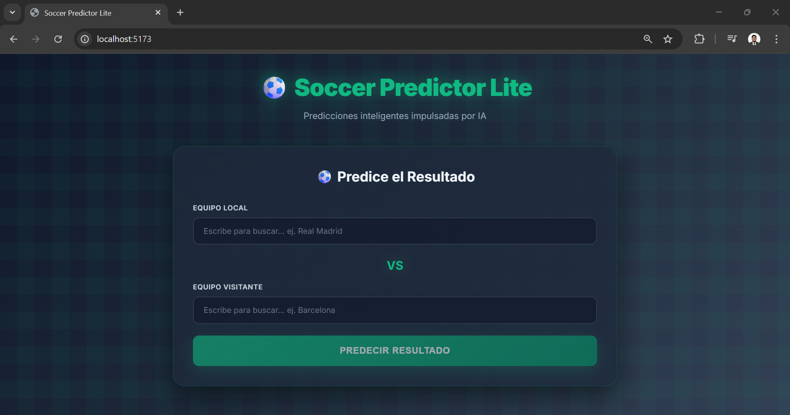

<div align="center">

# ⚽ Soccer Predictor Lite

### Predicción de Partidos de Fútbol con Inteligencia Artificial

<p align="center">
  
  
  
  
  
</p>

Una aplicación web moderna que predice resultados de partidos de fútbol utilizando **Google Gemini AI**, con búsqueda inteligente de equipos mediante **Football API** y visualización de datos interactiva.

[Demo](#-demo) • [Características](#-características) • [Instalación](#-instalación) • [Uso](#-uso) • [Tecnologías](#-tecnologías)

</div>

---

## 📸 Demo



---

## ✨ Características

- **🤖 Predicciones con IA**: Análisis avanzado de partidos usando Google Gemini 2.5 Flash
- **🔍 Búsqueda Inteligente**: Combobox con autocompletado que busca entre 100+ equipos reales
- **🖼️ Logos de Equipos**: Visualización de escudos oficiales mediante Football API
- **📊 Visualización de Datos**: Gráficos de pastel y barras de probabilidad interactivas
- **🎯 Análisis Detallado**: Marcador predicho, probabilidades (Victoria Local/Visitante/Empate), nivel de confianza
- **⚡ Interfaz Moderna**: Diseño glassmorphism con animaciones suaves y gradientes
- **📱 Responsive**: Optimizado para dispositivos móviles, tablets y escritorio
- **💾 Caché Inteligente**: Sistema de caché de 30 minutos para búsquedas de equipos
- **🔄 Fallback**: 12 equipos predeterminados si la API no está disponible

## 📋 Prerequisitos

- **Node.js 18+** y npm/yarn
- **API Key de Google Gemini** (obligatorio)
- **Football API Key** (opcional - para logos de equipos)

---

## 🔧 Instalación

### 1️⃣ Clona el repositorio
```bash
git clone https://github.com/romulopalacios/soccer-prediction.git
cd soccer-prediction
```

### 2️⃣ Instala las dependencias
```bash
npm install
```

### 3️⃣ Configura las API Keys

Crea un archivo `.env` en la raíz del proyecto:

```env
VITE_GEMINI_API_KEY=tu_gemini_api_key_aqui
VITE_FOOTBALL_API_KEY=tu_football_api_key_aqui_opcional
```

#### 🔑 Obtener Gemini API Key (obligatorio)
1. Ve a [Google AI Studio](https://aistudio.google.com/app/apikey)
2. Inicia sesión con tu cuenta de Google
3. Crea una nueva API Key
4. Copia la key al archivo `.env`

#### ⚽ Obtener Football API Key (opcional)
1. Regístrate en [API-Football](https://www.api-football.com/)
2. Obtén tu clave gratuita (100 requests/día)
3. Agrégala al archivo `.env`

> **Nota:** Sin Football API, la app usará 12 equipos predeterminados con emojis en lugar de logos.

## 🎮 Uso

### Modo Desarrollo
```bash
npm run dev
```
La aplicación estará disponible en `http://localhost:5173`

### Compilar para Producción
```bash
npm run build
```

### Vista Previa de Producción
```bash
npm run preview
```

## 🏗️ Estructura del Proyecto

```
soccer-prediction/
├── src/
│   ├── components/
│   │   ├── Combobox.tsx             # Búsqueda autocompletado con Football API
│   │   ├── Combobox.css
│   │   ├── PredictionForm.tsx       # Formulario de entrada
│   │   ├── PredictionForm.css
│   │   ├── PredictionResults.tsx    # Visualización de resultados con gráficos
│   │   └── PredictionResults.css
│   ├── services/
│   │   ├── geminiApi.ts             # Integración con Gemini AI
│   │   └── footballApi.ts           # Integración con Football API
│   ├── data/
│   │   └── teams.ts                 # Equipos predeterminados (fallback)
│   ├── types/
│   │   └── prediction.ts            # Tipos TypeScript
│   ├── App.tsx                      # Componente principal
│   ├── App.css                      # Estilos globales con glassmorphism
│   ├── main.tsx                     # Punto de entrada React
│   └── index.css                    # Reset y variables CSS
├── index.html                       # HTML template
├── .env                             # Variables de entorno (no incluido en repo)
├── .env.example                     # Template para configuración
├── package.json
├── tsconfig.json
├── vite.config.ts                   # Configuración de Vite
└── README.md
```

## 🎨 Tecnologías

<div align="center">

| Frontend | AI & APIs | Tooling |
|----------|-----------|---------|
|  |  |  |
|  |  |  |
|  | |  |

</div>

### Stack Detallado

- **React 18.3.1** - Biblioteca UI con hooks modernos
- **TypeScript 5.6.3** - Tipado estático para mayor seguridad
- **Vite 5.4.11** - Build tool ultra-rápido con HMR
- **Recharts 2.12.7** - Gráficos interactivos basados en D3.js
- **@google/generative-ai 0.21.0** - SDK oficial de Gemini AI
- **CSS3** - Animaciones, gradientes y glassmorphism
- **Inter Font** - Tipografía moderna de Google Fonts

---

## 🔑 Características Técnicas

### 🤖 Integración con Gemini AI
```typescript
// La app usa Gemini 2.5 Flash con parsing JSON estructurado
- Modelo: gemini-2.5-flash
- Análisis contextual de equipos y estadísticas
- Respuestas estructuradas con validación
- Timeout de 30 segundos
```

**Estructura de respuesta:**
- ✅ Marcador predicho (home/away)
- ✅ Ganador (home/away/draw)
- ✅ Probabilidades porcentuales para cada resultado
- ✅ Nivel de confianza (low/medium/high)
- ✅ 3 factores clave del análisis

### ⚽ Integración con Football API
```typescript
// Búsqueda en tiempo real de equipos con logos
- Cache de 30 minutos para optimizar requests
- Debounce de 300ms en búsquedas
- Fallback a 12 equipos predeterminados
- Soporte para 100+ equipos de ligas principales
```

### 🎨 Diseño UI/UX
- **Glassmorphism**: Fondos blur con transparencias
- **Patrón de césped**: Textura sutil en el fondo
- **Animaciones CSS**: FadeIn, shimmer, hover effects
- **Gradientes**: Paleta verde (emerald) y gris (slate)
- **Responsive**: Breakpoints para móvil, tablet y desktop
- **Accesibilidad**: WAI-ARIA en Combobox, navegación con teclado

## 📝 Ejemplo de Uso

### Flujo Completo

1. **Selecciona el equipo local**
   - Escribe en el Combobox (ej. "Real Madrid")
   - Selecciona de las sugerencias con logos
   - Usa ↑↓ para navegar, Enter para seleccionar

2. **Selecciona el equipo visitante**
   - Repite el proceso (ej. "Barcelona")

3. **Genera la predicción**
   - Haz clic en "Predecir Resultado"
   - Espera 2-5 segundos mientras Gemini analiza

4. **Explora los resultados**
   - 🏆 Marcador predicho con logos de equipos
   - 📊 Gráfico de pastel con probabilidades
   - 📈 Barras de progreso animadas
   - 🔍 3 factores clave del análisis
   - ⭐ Nivel de confianza de la predicción

5. **Nueva predicción**
   - Clic en "Nueva Predicción" para reiniciar

---

## 🐛 Solución de Problemas

### ❌ Error: "VITE_GEMINI_API_KEY is not defined"
**Solución:**
- Verifica que el archivo `.env` exista en la raíz del proyecto
- Asegúrate de que la variable esté correctamente nombrada (debe empezar con `VITE_`)
- Reinicia el servidor de desarrollo (`npm run dev`)

### ❌ Error: "Failed to fetch prediction"
**Solución:**
- Verifica que tu API Key de Gemini sea válida
- Comprueba tu conexión a internet
- Revisa la consola del navegador para más detalles

### ❌ No aparecen logos de equipos
**Solución:**
- Verifica que `VITE_FOOTBALL_API_KEY` esté configurada en `.env`
- La app funcionará sin logos usando emojis como fallback
- Límite de 100 requests/día en el plan gratuito

### ❌ Error de compilación TypeScript
**Solución:**
```bash
# Limpia caché y reinstala dependencias
rm -rf node_modules package-lock.json
npm install
npm run dev
```

---

## 📊 Optimizaciones

- ✅ **Code Splitting**: Chunks separados para React, Charts y Gemini
- ✅ **Lazy Loading**: Componentes cargados bajo demanda
- ✅ **Caché**: Sistema de caché para búsquedas de equipos
- ✅ **Debounce**: Optimización de búsquedas en tiempo real
- ✅ **Tree Shaking**: Eliminación de código no utilizado
- ✅ **Minificación**: Build optimizado para producción

---

## 📄 Licencia

Este proyecto está bajo la **Licencia MIT**. Puedes usar, modificar y distribuir libremente.

---

## 🤝 Contribuciones

¡Las contribuciones son bienvenidas! 🎉

1. **Fork** el proyecto
2. Crea una **rama** para tu feature (`git checkout -b feature/AmazingFeature`)
3. **Commit** tus cambios (`git commit -m 'Add: nueva funcionalidad'`)
4. **Push** a la rama (`git push origin feature/AmazingFeature`)
5. Abre un **Pull Request**

### Ideas para contribuir:
- 🌐 Agregar más idiomas (i18n)
- 📱 Mejorar la versión móvil
- 📊 Agregar más tipos de gráficos
- 🔍 Filtros por ligas/competiciones
- 💾 Historial de predicciones
- 🌙 Modo oscuro/claro

---

## 👨‍💻 Autor

**Romulo Palacios**
- GitHub: [@romulopalacios](https://github.com/romulopalacios)

---

## 🙏 Agradecimientos

- [Google Gemini AI](https://ai.google.dev/) - Por la API de predicciones
- [API-Football](https://www.api-football.com/) - Por los datos de equipos
- [Recharts](https://recharts.org/) - Por los gráficos interactivos
- [Vite](https://vitejs.dev/) - Por el increíble tooling

---

## ⚠️ Disclaimer

Esta aplicación utiliza **Inteligencia Artificial** para generar predicciones basadas en análisis automático. Los resultados son **estimaciones** y **no deben usarse para apuestas reales**. El fútbol es impredecible y esta herramienta es solo para fines educativos y de entretenimiento.

---

<div align="center">

### ⭐ Si te gustó el proyecto, dale una estrella en GitHub

**Hecho con ❤️ usando React + TypeScript + Gemini AI**

</div>
